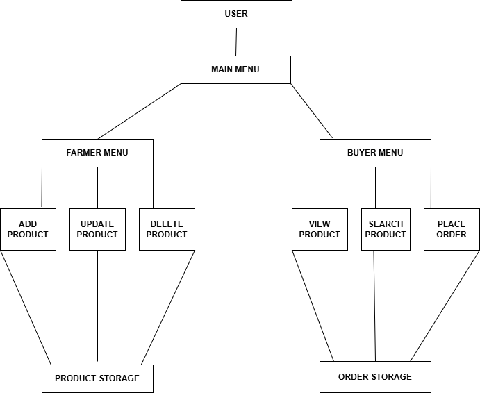

# 🌾 FarmConnect – Java Console Application

FarmConnect is a **Java-based console application** that connects farmers and buyers through a simple product and order management system.  
It demonstrates **Object-Oriented Programming (OOP)** concepts and basic system design using Java.

---

## 📌 Features

### 👨‍🌾 Farmer Operations
- Add Product
- Update Product
- Delete Product
- View Products
- View Orders

### 🛒 Buyer Operations
- View Products
- Search Product
- Place Order

### ⚙️ System Features
- Menu-driven console interface
- Product storage using arrays
- Order management system
- Exception handling for invalid inputs
- Clean OOP structure

---

## 🏗️ System Architecture

The system is divided into two major modules:
## 📊 System Block Diagram

---

# 🌾 FarmConnect – Java Console Application

FarmConnect is a **Java-based console application** that connects farmers and buyers through a simple product and order management system.  
It demonstrates **Object-Oriented Programming (OOP)** concepts and basic system design using Java.

---

## 📌 Features

### 👨‍🌾 Farmer Operations
- Add Product
- Update Product
- Delete Product
- View Products
- View Orders

### 🛒 Buyer Operations
- View Products
- Search Product
- Place Order

### ⚙️ System Features
- Menu-driven console interface
- Product storage using arrays
- Order management system
- Exception handling for invalid inputs
- Clean OOP structure

---

## 🏗️ System Architecture

The system is divided into two major modules:
Main Menu
│
├── Farmer Menu
│ ├── Add Product
│ ├── Update Product
│ ├── Delete Product
│ └── View Products / Orders
│
└── Buyer Menu
├── View Products
├── Search Product
└── Place Order

Products and orders are stored using **arrays** and managed through the `FarmConnectSystem` class.

---

## 🧠 OOP Concepts Used

This project demonstrates several important **Object-Oriented Programming concepts**:

- Classes & Objects
- Encapsulation
- Constructors
- Method interaction
- Modular design

---

## 📂 Project Structure

Products and orders are stored using **arrays** and managed through the `FarmConnectSystem` class.

---

## 🧠 OOP Concepts Used

This project demonstrates several important **Object-Oriented Programming concepts**:

- Classes & Objects
- Encapsulation
- Constructors
- Method interaction
- Modular design

---

## 📂 Project Structure

Farmconnect-java
│
├── src/com/farmconnect
│ ├── Main.java
│ ├── FarmConnectSystem.java
│ ├── Product.java
│ └── Order.java
│
├── diagrams
│ └── system-block-diagram.png
│
└── README.md

---

## 💻 Technologies Used

- Java
- Eclipse IDE
- Git
- GitHub

---

## ▶️ How to Run the Project

1. Clone the repository

git clone https://github.com/ahmed07x-1/Farmconnect-java.git

2. Open the project in **Eclipse or any Java IDE**

3. Run the `Main.java` file

4. Follow the console menu to interact with the system.

---

## 📊 Sample Output

1 Add Product
2 Update Product
3 Delete Product
4 View Products
5 View Orders
6 Exit

---

## 🚀 Future Improvements

- Database integration (MySQL)
- GUI interface using JavaFX or Swing
- User authentication
- Product search optimization
- Web-based version

---

## 👨‍💻 Author

**Mohd Younus Ahmed**

Cybersecurity Student | Java Developer | Backend Developer | Aspiring Full Stack Developer

📚 Currently focusing on:

* Java Development
* Object-Oriented Programming (OOP)
* Backend Development
* Cybersecurity

🔗 GitHub
https://github.com/ahmed07x-1

⭐ If you like this project, consider starring the repository.

